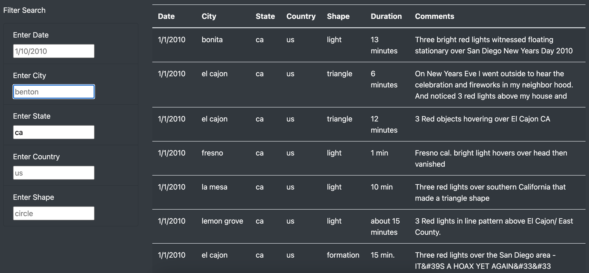

# UFOs

## Overview of Project

### Purpose
For this project, I used Javascript, HTML, and CSS to create a dynamic webpage to show data from UFO sightings in the last decade. On this webpage, users can filter UFO Sightings with up to 5 different filters. Filters include location (city, state, country), date, and shape of UFO spotted. 

## Results

### How to Perform a Search
Luckily, this dynamic webpage keeps it simple. First access the webpage. The homepage should look like the image below:

   

Next, scroll down to find the Filter Search section. At first, you will see all of the UFO sightings listed. You can filter for any of the five categories. In the image below, I included an image of me filtering for UFO sightings in California. I input "ca", the code for California, into the filter labeled as State. When I pressed enter, a list of the UFO Sightings filtered for California will show up. See the image of the filtered results below: 

   

Remember that you can filter for any of the categories provided! Check it out for yourself. 

## Summary 

### One Drawback
One major drawback of the site is the range of data available for UFO Sightings. Most notable, the data range is limited to only the first 13 days of 2010. If someone was curious about more recent sightings or wanted to compare UFO Sightings across the decade, they would not be able to do so using this website. 

### Recommendations for Further Development

- #1 The first recommendation I have is related to the drawback I pointed out. I recommend that we draw from a dataset with wider range of dates and locations. That way, this website can be more of a "one stop shop" for researchers. 

- #2 My second recommendation is to include a keyword search filter for the UFO Sighting description. This way, those who are interested can filter UFO Sightings by how they are descriibed to find patterns and potentially draw conclusions. 
